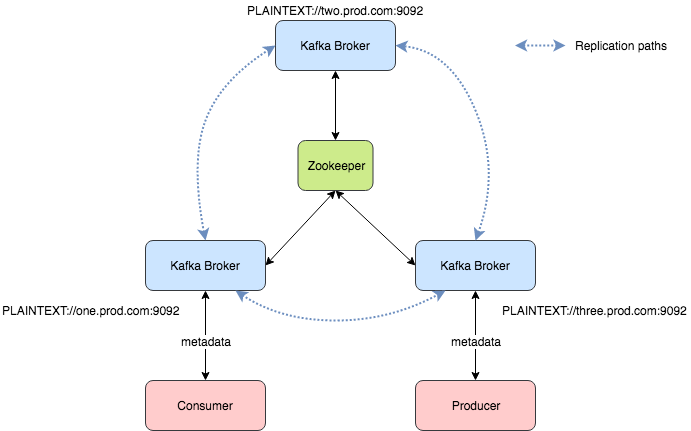
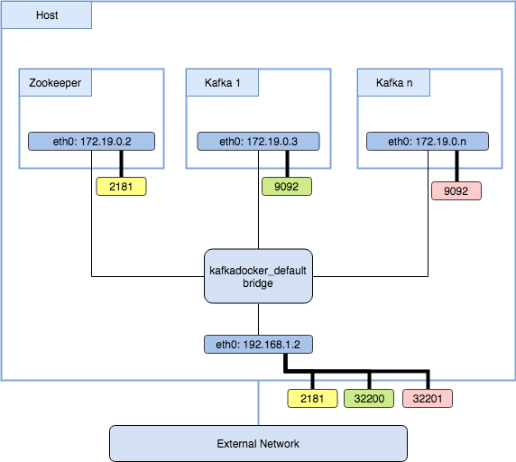

# Dockerized 3rd Party Components in ScalaTest

---

## The TestContainers Library

* pure Java library - docker CLI is not needed
* self contained - all depenencies are sharded (won't confilict with apache when trying to use the Unix socket)
*  simple (almost declerative) API

---

### Simple Start

* Starting and stopping a Docker container before and after a test Suite.
* Accessing the container from the test
* Container logs
* Linux and Mac support (Windows on best effort basis)

+++

#### Starting ES container

```scala
class TestESSuiteDemo extends FlatSpec with ForAllTestContainer {
  val elasticsearchVersion: String = "6.5.4"

  override val container = {
    val scalaContainer = GenericContainer(s"docker.elastic.co/elasticsearch/elasticsearch-oss:$elasticsearchVersion",
      exposedPorts = Seq(9200),
      waitStrategy = Wait.forHttp("/").forPort(9200).forStatusCode(200),
      env = Map("discovery.type" -> "single-node", "ES_JAVA_OPTS" -> "-Xms2000m -Xmx2000m")
    )
    scalaContainer.configure { container =>
      val logger = new Slf4jLogConsumer(LoggerFactory.getLogger(s"elasticsearch-oss:$elasticsearchVersion"))
      container.withLogConsumer(logger)
    }
    scalaContainer
  }

  "TestEsSuiteDemo" should "work" in {
    val output = scala.io.Source.fromURL(s"http://${container.containerIpAddress}:${container.mappedPort(9200)}").mkString
    print(s"The output:\n$output\n")
    assert(true)
  }

}
```
@[1](Start the container before the suite and close it after)
@[4](the container)
@[5](container declaration)
@[6](the container)
@[5-16](getting access to the internal Java container)

+++

### Live Demo

* Fast start and stop
* Monitoring crashed test JVM (e.g. pressing stop in Intellij)
* Keeps the host machine clean after the tests
* Debugging in Intellij!
* Running a single test and not the whole test suite (even from Intellij)

---

### Multiple Containers

```scala
  def elasticsearch(elasticsearchVersion: String): GenericContainer = {
    val scalaContainer = GenericContainer(s"docker.elastic.co/elasticsearch/elasticsearch-oss:$elasticsearchVersion",
      exposedPorts = Seq(9200),
      waitStrategy = Wait.forHttp("/").forPort(9200).forStatusCode(200),
      env = Map("discovery.type" -> "single-node", "ES_JAVA_OPTS" -> "-Xms2000m -Xmx2000m")
    )
    scalaContainer.configure { container =>
      val logger = new Slf4jLogConsumer(LoggerFactory.getLogger(s"elasticsearch-oss:$elasticsearchVersion"))
      container.withLogConsumer(logger)
    }
    scalaContainer
  }

  def cassandra(cassandraVersion: String): GenericContainer = {
    val scalaContainer = GenericContainer(s"cassandra:$cassandraVersion",
      waitStrategy = Wait.forLogMessage(".*Starting listening for CQL clients.*\n", 1),
      env = Map("JVM_OPTS" -> "-Xms1G -Xmx1G")
    )
    scalaContainer.configure { container =>
      val logger = new Slf4jLogConsumer(LoggerFactory.getLogger(container.getDockerImageName))
      container.withLogConsumer(logger)
    }
    scalaContainer
  }
```

@[15](Another wait strategy)

+++

#### The Trait (reusable for several test suites)

```scala
trait EsCasDockerSuite extends ForAllTestContainer { this:Suite =>
  def cassandraVersion: String
  def elasticsearchVersion: String
  val elasticsearchContainer = ContainerHelpers.elasticsearch(elasticsearchVersion)
  val cassandraContainer = ContainerHelpers.cassandra(cassandraVersion)
  override val container = MultipleContainers(cassandraContainer, elasticsearchContainer)
}
```
@[6](Note: the containers won't start in parallel)

+++

#### The Actual Test Suite

```scala
class TestESCasSuite extends FlatSpec with EsCasDockerSuite {
  override def elasticsearchVersion: String = "6.5.4"
  override def cassandraVersion: String = "3.11.3"

  "EsCasDockerSuite" should "work" in {
    assert(true)
  }
}
```

---

### Starting the Containers in Parallel

```scala
class MultipleContainersParallelExecution private(containers: Seq[LazyContainer[_]]) extends Container {
  import scala.concurrent.ExecutionContext.Implicits.global
  import scala.concurrent.duration._

  override def finished()(implicit description: Description): Unit = {
    val f = Future.traverse(containers)(lazyContainer => Future(lazyContainer.finished()(description)))
    Await.ready(f, 5.minutes)
  }

  override def succeeded()(implicit description: Description): Unit = {
    val f = Future.traverse(containers)(lazyContainer => Future(lazyContainer.succeeded()(description)))
    Await.ready(f, 5.minutes)
  }

  override def starting()(implicit description: Description): Unit = {
    val f = Future.traverse(containers)(lazyContainer => Future(lazyContainer.starting()(description)))
    Await.ready(f, 5.minutes)
  }

  override def failed(e: Throwable)(implicit description: Description): Unit = {
    val f = Future.traverse(containers)(lazyContainer => Future(lazyContainer.failed(e)(description)))
    Await.ready(f, 5.minutes)
  }
}

object MultipleContainersParallelExecution {

  def apply(containers: LazyContainer[_]*): MultipleContainersParallelExecution = new MultipleContainersParallelExecution(containers)
}
```

---

## Special Case Study
#### Kafka

+++

### The Challenge



+++

### Solution?



+++

### The Solution

```scala
def kafkaAndZookeeper(kafkaVersion: String, zookeeperVersion: String): KafkaZookeeperContainers = {
  val internalNetwork = Network.newNetwork()
  lazy val zookeeperContainer = {
    val scalaContainer = GenericContainer(s"zookeeper:$zookeeperVersion",
      exposedPorts = Seq(2181),
      waitStrategy = Wait.forLogMessage(".*binding to port 0.0.0.0/0.0.0.0:2181.*\n", 1)
    )
    scalaContainer.configure { container =>
      container.withNetwork(internalNetwork)
      container.withNetworkAliases("zookeeper")
      val logger = new Slf4jLogConsumer(LoggerFactory.getLogger(container.getDockerImageName))
      container.withLogConsumer(logger)
    }
    scalaContainer
  }
  lazy val kafkaContainer = {
    val externalPort = 9092
    val internalPort = 10000 + externalPort
    val brokerId = 1
    val scalaContainer = GenericContainer(s"wurstmeister/kafka:$kafkaVersion",
      exposedPorts = Seq(externalPort),
      env = Map(
        "KAFKA_ZOOKEEPER_CONNECT" -> s"zookeeper:2181",
        "KAFKA_LISTENERS" -> s"INTERNAL://0.0.0.0:$internalPort,EXTERNAL://0.0.0.0:$externalPort",
        "KAFKA_LISTENER_SECURITY_PROTOCOL_MAP" -> s"INTERNAL:PLAINTEXT,EXTERNAL:PLAINTEXT",
        "KAFKA_INTER_BROKER_LISTENER_NAME" -> s"INTERNAL",
        "KAFKA_CREATE_TOPICS" -> s"persist_topic:1:1,persist_topic.priority:1:1,index_topic:1:1,index_topic.priority:1:1",
        "KAFKA_BROKER_ID" -> s"$brokerId"
      ),
      waitStrategy = Wait.forLogMessage(".*KafkaServer.*started.*\n", 1)
    )
    scalaContainer.configure { container =>
      container.withNetwork(internalNetwork)
      val networkAlias = s"kafkaBroker-$brokerId"
      container.withNetworkAliases(networkAlias)
      //The network alias can be used the advertising listeners later (for multi brokers configuration)
      container.addEnv("KAFKA_ADVERTISED_LISTENERS", s"INTERNAL://$networkAlias:$internalPort")
      val logger = new Slf4jLogConsumer(LoggerFactory.getLogger(container.getDockerImageName))
      container.withLogConsumer(logger)
    }
    scalaContainer
  }
  val combined = MultipleContainers(zookeeperContainer, kafkaContainer)
  KafkaZookeeperContainers(kafkaContainer, zookeeperContainer, combined)
}
```